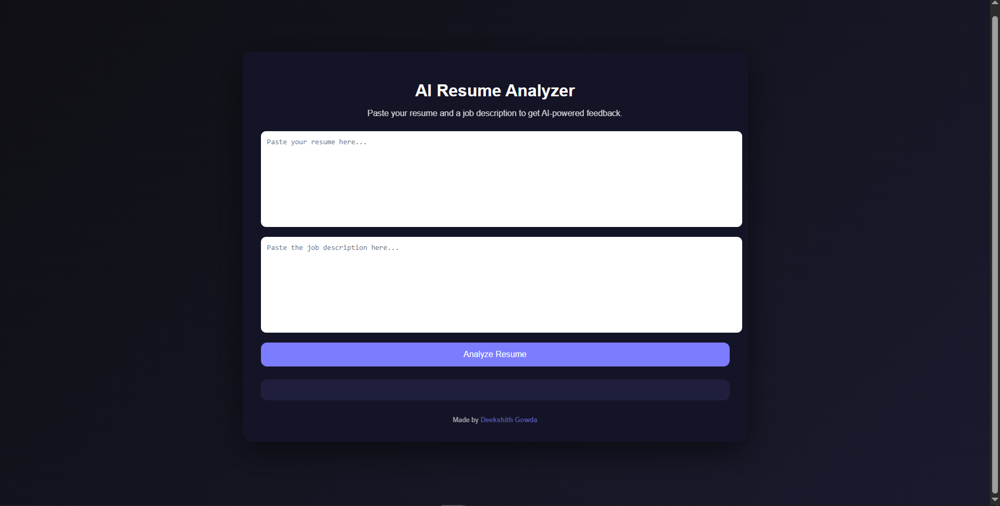
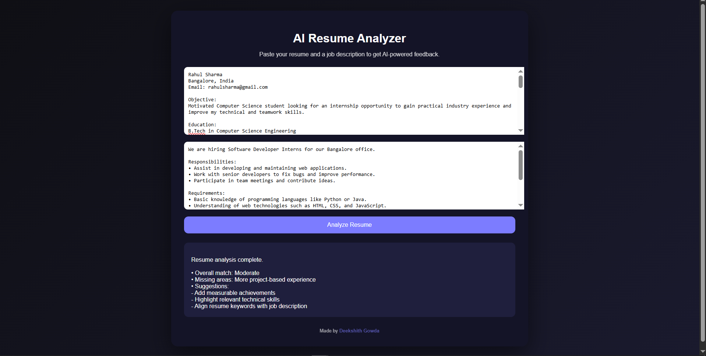

#  Resume Analyzer

Resume Analyzer is a web application that analyzes resumes to extract key information and provide insights to help improve job applications. This project demonstrates the use of web technologies and text processing to evaluate resume content efficiently.

##  Project Overview
Recruiters often review resumes quickly, and automated systems are commonly used to filter candidates. Resume Analyzer helps users improve resume quality by analyzing uploaded resumes and presenting structured results.

##  Features
- Upload resumes for analysis
- Extract important resume details
- Identify skills and relevant information
- Provide resume improvement insights
- Simple and user-friendly interface

##  Tech Stack
Frontend:
- HTML
- CSS
- JavaScript

##  Application Preview

### Resume Upload Page

### Analysis Result Page

Backend:
- Node.js / Python

Tools:
- Git
- GitHub

##  Repository Structure
Resume-Analyzer
   ├── frontend
   ├── backend
   |── README.md

