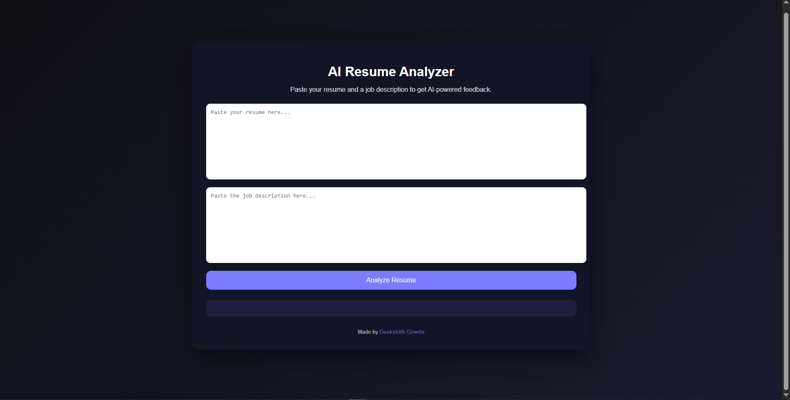
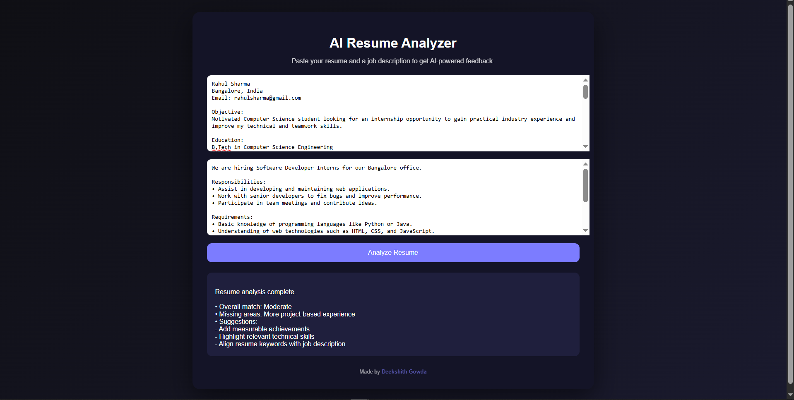

# 📄 Resume Analyzer

An AI-powered web application that analyzes resumes, extracts key information, and provides actionable improvement insights to help candidates stand out.

## ✨ Features
- Upload resume for instant analysis
- Extracts skills, experience, and key details automatically
- Provides structured feedback and improvement suggestions
- Clean, intuitive frontend interface
- Separate frontend/backend architecture

## 🛠️ Tech Stack
**Frontend:** HTML, CSS, JavaScript
**Backend:** Node.js / Python
**Tools:** Git, GitHub

## 📸 Screenshots

### Upload Page


### Analysis Results


## 🔧 Run Locally

Clone the repo:
```bash
git clone https://github.com/deekshith-8/Resume-Analyzer.git
cd Resume-Analyzer
```

Start the backend:
```bash
cd backend
pip install -r requirements.txt
python app.py
```

Open `frontend/index.html` in your browser.

## 👤 Built by
**Deekshith Gowda** — [LinkedIn](https://linkedin.com/in/deekshithg1206) · [GitHub](https://github.com/deekshith-8)
